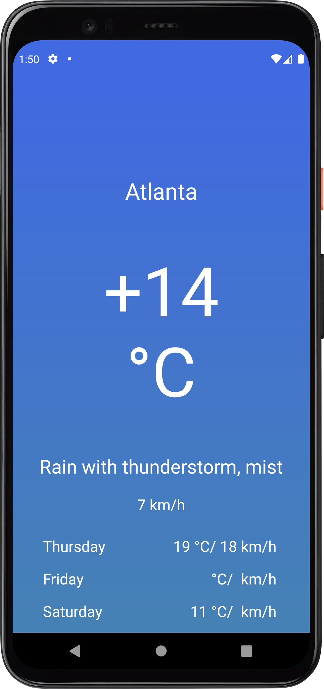

# AndroidWeatherApp

## About

An Android App that displays the current weather conditions and three-day forecast for the desired city

## Features
* Kotlin
* MVVM Architecture
* Retrofit
* Dagger-Hilt
* Coroutine
* Weather API

## Screenshot

